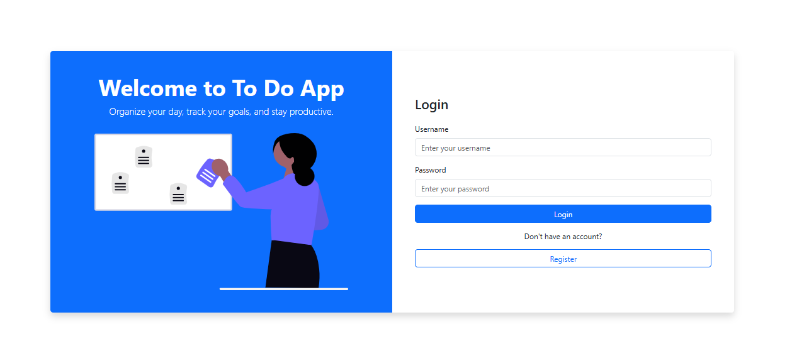
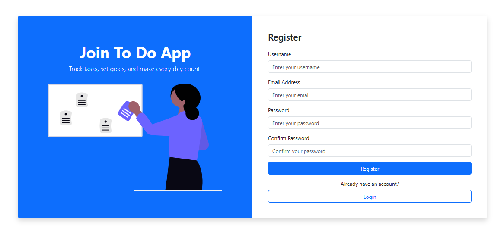
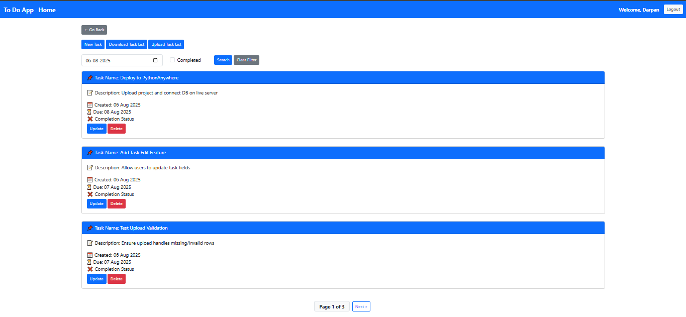

# To-Do App

A simple and user-friendly task management app built with Django and Bootstrap. Users can create, update, delete, and filter their tasks efficiently with a clean and responsive interface.


## Features

- User Authentication (Register, Login, Logout)
- Add New Task
- Update Existing Task
- Delete Task
- Upload Task List (from Excel)
- Download Task List (as Excel)
- Filter Tasks by Completion Date and Status
- Mark Tasks as Completed
- Fully Responsive with Bootstrap 5


## Tech Stack

- **Backend:** Django (Python)
- **Frontend:** Bootstrap 5 + HTML Templates
- **Database:** SQLite (default)
- **Other:** Django Messages Framework, Static Files, Excel Support via `pandas` or `openpyxl`


#  Installation Guide for To do App Project

# 1. Clone the repository
git clone https://github.com/Darpan-Anjanay/TodoList.git  # Download the project from GitHub
cd todolist  # Move into the project directory

# 2. Create a virtual environment
python -m venv venv  # Create a virtual environment named 'venv'

# 3. Activate the virtual environment

venv\Scripts\activate  # For Windows

# 4. Install the project dependencies
pip install -r requirements.txt  # Install all required packages listed in requirements.txt

# 5. Set up the database
python manage.py makemigrations  # Generate migration files based on the models
python manage.py migrate  # Apply the migrations to create the database schema

# 6. Create a superuser for accessing the Django admin panel
python manage.py createsuperuser  # Follow the prompts (username, email, password)

# 7. Run the development server
python manage.py runserver  # Start the local server

#  Now, open your browser and go to: http://127.0.0.1:8000/
#  To access the admin panel, visit: http://127.0.0.1:8000/admin/
 


## Author

- **Name:** Darpan Anjanay
- **GitHub:** https://github.com/Darpan-Anjanay/


**Screenshots**
```md
## Screenshots

### Login Page

## Register Page


### 🏠 Home Page


### 📝 Add Task


### 📋 Task List


### 📋 Upload Task List


